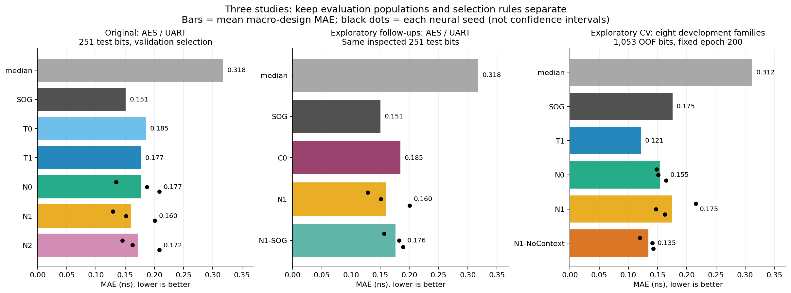
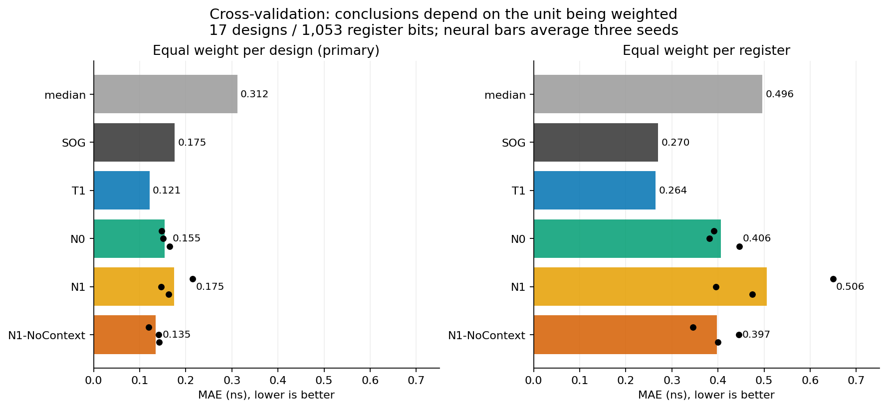
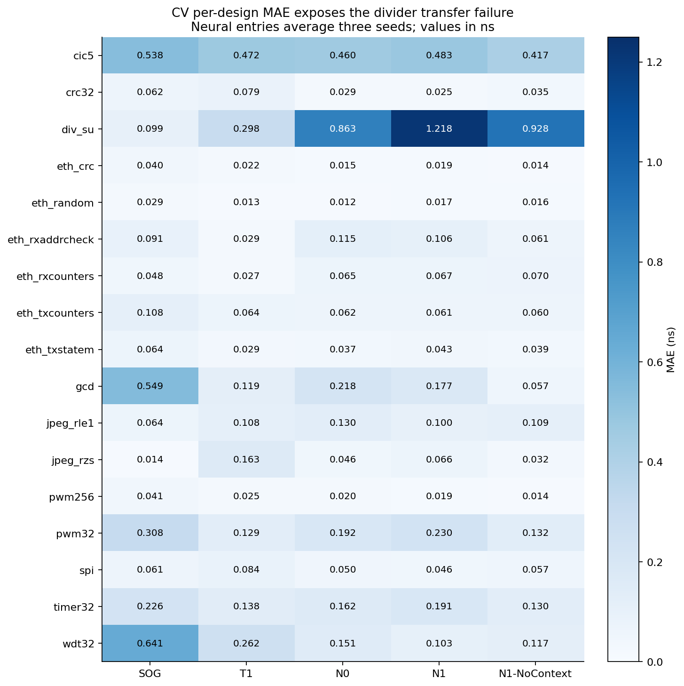
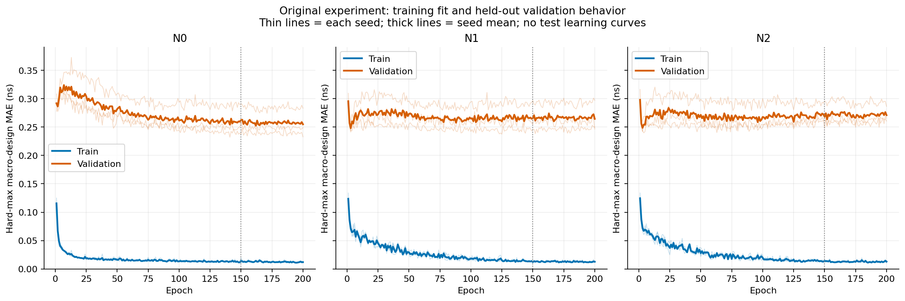

# Delivery index — start here

The experimental stage is closed. All requested runs completed; the methods, results and reflection are complete. The current report and reflection are the authoritative summary; dated proposals and decision entries preserve how the work evolved.

## Read in this order

1. [Research report](report.md): Tasks 1–3, dataset validation and results.
2. [Task 4 reflections](task4-reflections.md): measured strengths/limits, prioritized future work, and observed versus hypothetical open-source-flow differences.
3. [Implementation overview](implementation.md): the data flow, code organization and verification boundaries.
4. [Reproduction guide](reproduction.md): review-only use versus rerunning the pinned experiment.
5. [Sequential decision log](decisions.md): the rationale for choices, corrections and rejected/deferred approaches.

## Results, with evaluation boundaries preserved



The original experiment uses AES/UART as held-out test families. The first follow-ups reuse that inspected test set. The final CV study uses eight development families and excludes AES/UART. Do not compare errors across these populations as if they were the same test.

- [All-study results ledger](results/experiment-ledger.csv): every model/seed score; repeated references are explicitly associated with their study.
- [Original full metrics](results/task3_original_metrics.json) and [original per-run summary](results/task3_original_summary.csv).
- [SOG follow-up full metrics](results/task3_followup_metrics.json) and [execution audit](results/task3_followup_execution.json).
- [CV summary](results/task3_generalization_summary.md), [all fold/seed metrics](results/task3_generalization_fold_seed_metrics.csv), [paired comparisons](results/task3_generalization_paired_differences.csv), [per-design errors](results/task3_generalization_per_design.csv), and [execution audit](results/task3_generalization_execution.json).







Figures are descriptive views of sealed outputs. Black dots show individual seeds, not confidence intervals. Thin learning curves show individual seeds and thick curves their mean. No test learning curves were collected. Rebuild with `uv sync --project reporting --frozen` followed by `uv run --project reporting python reporting/build_figures.py`. The reporting lock is independent of the two preserved experimental environments. SVG versions are alongside the PNGs; input hashes and plotting versions are in `figures/provenance.json`.

## Methods and implementation

| Stage | Contract / commands | Main implementation |
|---|---|---|
| Collection / BOG features | [Feature contract](task1-features.md), [Task 1 runbook](task1-runbook.md), [attribution](attribution.md) | `src/rtl_timing/{sources,eda,graph,features,libraries}.py` |
| Labels / release | [Label contract](task2-label-contract.md), [Task 2 runbook](task2-runbook.md), [manual pilot review](task2-pilot-observations.md) | `src/rtl_timing/labels.py`, `scripts/export_dataset.py`, validation scripts |
| Original models | [Frozen experiment decisions](task3-experiment-plan.md), [original runbook](task3-runbook.md) | `modeling/` |
| Calibration / SOG-only | [Follow-up runbook](task3-followup-runbook.md) | `experiments/task3_followup/` |
| CV / context ablation | [Generalization runbook](task3-generalization-runbook.md) | `experiments/task3_generalization/` |
| Saved-artifact figures / packaging | This index | `reporting/build_figures.py`, `reporting/package_delivery.py` |

The 52 recorded tests comprise 20 data-pipeline, 15 original modeling, eight follow-up and nine generalization tests. Counts do not substitute for scope: label checks test internal STA consistency, formal checks have a defined mapping boundary, and model tests establish protocol behavior rather than universal generalization.

## Artifact locations and package contents

All three completed studies are available locally under `runs/` and on the server under `/home/sashi/rtl-timing-estimation/runs/`:

| Run | Fitted runs | Neural epochs | Evaluation |
|---|---:|---:|---|
| `task3-20260925-v1` | 11 | 1,800 | Original AES/UART test |
| `task3-followup-20260925-v1` | 4 (includes calibration) | 600 | Exploratory same-test follow-ups |
| `task3-generalization-20260925-v1` | 40 | 7,200 | Exploratory development-family OOF |
| Total | **55** | **9,600** | Distinct studies, not one pooled benchmark |

Each run retains its models/checkpoints, preparation/selection provenance, final predictions/metrics, histories and diagnostics. The CV package has 331 individually verified files, 12,636 unique prediction rows and 40 model seals. Original/follow-up results retain their own seals; they were not rewritten by the later study.

`output/rtl-timing-review.zip` packages the current source, locks, documentation, figures, compact Task 2 tables/release evidence, and **all three complete modeling run directories**, excluding caches and atomic temporary files. `DELIVERY-MANIFEST.json` inside it hashes every included payload file and records the source revision and exact file state. `output/rtl-timing-review.zip.sha256` verifies the archive. This is a private review package, not a public publication or a new experiment.

The much larger raw EDA reports, source libraries and RTL remain available separately in the existing Task 2 bundle: `/home/sashi/task2-complete-artifacts.tar.gz`, SHA-256 `30016d848573104483630fe411ee2d53f01215a76b9d62399a7316526ac2a634` (205,502,026 bytes). Its contents are also extracted in this local workspace. See [bundle descriptor](results/task2_artifact_bundle.json). Raw third-party assets retain their own licensing/attribution; the review zip does not substitute for that complete EDA archive.

To regenerate the review archive after documentation changes:

```bash
python3 reporting/package_delivery.py
```

The packaging script verifies completed study seals, then verifies every zipped member against its manifest before reporting success. It does not fetch data, regenerate labels, train models, or alter historical outputs. Source revision identifies the repository base; payload hashes identify the exact packaged contents, including any explicitly recorded uncommitted files.

## Repository scope

The repository contains assessment deliverables: source, tests, pinned configurations, source manifests, methods, results, scientific decisions, reproducibility instructions and attribution. Personal study notes and rehearsal material are excluded from Git and reviewer archives. Large generated artifacts remain separate from Git; the archive and raw-data bundle locations above describe how to obtain or reproduce them.
