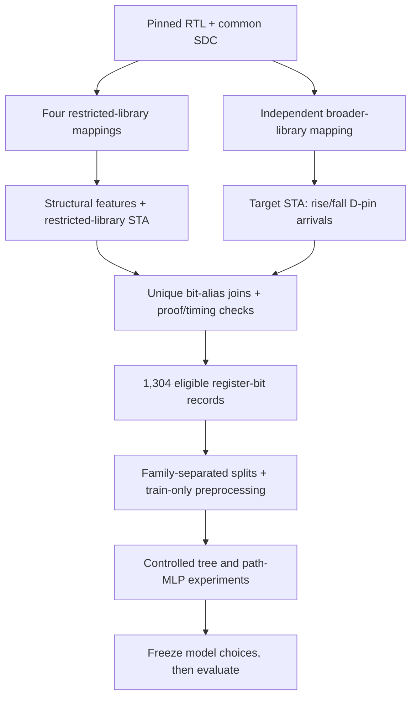

# Implementation overview

A register-bit example joins four restricted circuit representations to one independently generated target-circuit arrival label. “Representation” and “view” refer to SOG, AIG, AIMG and XAG throughout the modeling code.

## Collection and representations — Task 1

`data/manifests/designs.json` pins source repositories/revisions, files, dependencies, top modules and constraints. Sixteen retained designs come from the ORFS design collection and three from Yosys benchmarks; family IDs preserve shared project provenance. DCT's runtime exclusion is recorded separately.

`src/rtl_timing/sources.py` fetches exact files and hashes them. `eda.generate` emits the Yosys synthesis script, preserves pre-map JSON, maps registers with `dfflibmap` and combinational logic with ABC, and exports mapped JSON/Verilog. `graph.Bog` builds drivers, aliases, register endpoints and a combinational DAG, rejecting unsupported cells, multiple drivers and loops.

`Bog.cone` counts distinct upstream register/input sources. `Bog.sample_paths` proposes reproducible backward routes, bounded by driving-register count and a cap of 32. `eda.generate` emits per-endpoint/per-transition OpenSTA `report_checks` queries, including ordered constraints for sampled candidates. `features.extract` verifies returned paths, deduplicates routes and emits design/endpoint/path Parquet tables. Reading LEF metadata initializes OpenROAD; it does not perform placement.

Exact feature definitions, operator vocabularies, sampling limits and deviations from RTL-Timer are in the [feature contract](task1-features.md). Timing is performed by OpenSTA, not by assigning fixed delays to the Python DAG.

## Labels and eligibility — Task 2

`labels.generate_labels` independently synthesizes a broader supported Nangate45 target mapping from the same RTL/SDC. It queries maximum rise/fall D-pin arrivals and selects the larger. `parse_label_report` checks the endpoint, final pin, finite arrival and displayed delay sum; direct pin queries provide an additional within-engine consistency check.

`match_aliases` uses visible register-output bit aliases and accepts only unique one-to-one matches. Timing success alone does not imply training eligibility. Release validation checks identities, coverage, units, identical constraints, artifact hashes, target mapping and all four representation mapping proofs. The final release has 1,304 eligible bits and 95 passing mapping checks.

`eda.verify_mapped_netlist` uses `equiv_make`, `clk2fflogic`, `equiv_simple`, `equiv_induct -seq 4`, and `equiv_status -assert`. This is an inductive mapping check after state alignment against Yosys pre-map elaboration, not original frontend correctness or reset reachability. The isolated `reset_v1` library experiment added only dedicated reset/set cells; all representations were regenerated after its adoption gate. See the [label contract](task2-label-contract.md) and [release runbook](task2-runbook.md).

## Models and evaluation — Task 3

`modeling/data.py` builds explicit feature allowlists. Trees concatenate four endpoint/design/path-summary vectors. Neural models retain path bags, per-path/local/global quantities and representation indicators, using training-only per-representation scaling and padding masks. Only verified empty zero-gate driver statistics receive zero placeholders plus an indicator. IDs and target-derived metadata are not predictors.

`modeling/neural.py` defines the shared 64/32 MLP, hard/normalized-smooth pooling, deterministic minibatch ordering and AdamW updates. `modeling/train.py` handles T0/T1 and N0/N1/N2 training, atomic checkpoints and validation-only candidate selection. `metrics.py` distinguishes pooled, macro-design and macro-family-of-design errors. `finish.py` freezes all selections before common test evaluation.

The isolated `experiments/task3_followup/` package implements training-only affine calibration and paired SOG-only N1. `experiments/task3_generalization/` reconstructs raw features, fits four separate training-only preprocessing configurations, trains fixed epoch-200 models and masks normalized global design columns for the context ablation. The latter evaluates all 17 out-of-fold designs per seed; it does not average fold MAEs equally.

The original protocol is in [Task 3 experiment specification](task3-experiment-plan.md); later studies have separate runbooks. Original modeling code, lockfiles and completed artifacts remain immutable.

## Provenance, recovery and reporting

Data artifacts bind source/configuration/library/constraint/environment identities and output hashes. Missing or stale provenance forces regeneration; superseded directories are archived. Modeling manifests bind dataset, schema, split, code, runtime and settings. Atomic checkpoints retain model, optimizer, RNG, progress and history. Completed models are skipped only after seal verification.

User-level systemd services provide logout/reboot persistence, owner-only outputs, bounded retries and supervisor locks. The scripts also support foreground execution on a compatible Linux/CUDA host; service templates contain recorded deployment paths that must be adapted explicitly for a new deployment.

`reporting/build_figures.py` reads sealed result tables without refitting. `reporting/package_delivery.py` packages reviewer-facing code, data tables and completed studies, rejecting personal files and verifying archived hashes. See [reproduction](reproduction.md) and [delivery index](delivery-index.md) for artifact requirements and commands.
